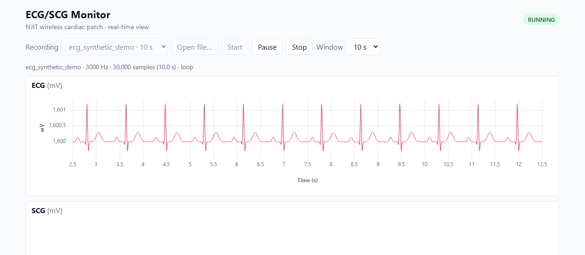

# Weekly update – 2026-10-07

## Done this week

- **The ECG now scrolls live in the browser** (milestone M1). It replays the lab ECG recording at its real speed:
  24 s of recording take 24 s on screen (measured: 26.03 s of signal in 26.01 s of clock time).
- The app reads the LabVIEW `.lvm` files from the lab directly. It computes the sampling rate from the time column
  (3000 Hz). The `Delta_X` value in the header would give 3003 Hz, which is wrong.
- Peaks stay sharp at any zoom: for each screen pixel the plot keeps the highest and the lowest sample, so a QRS
  is never lost when 30,000 samples are drawn on about 1,000 pixels.
- Controls: choose a recording or open a `.lvm` file from your own computer (it is read in the browser, never
  uploaded), Start / Pause / Stop, 5 s or 10 s window. Pause freezes the picture only: data keeps arriving.
- Smooth display: 60 frames per second in Chrome, with stable memory use over time.
- Project setup (M0) is complete: the code is on GitHub, the automatic tests run on every change, and the demo site
  is online. Real recordings stay off GitHub (data privacy).

## Demo

https://davidedaluisio.github.io/ecg-scg-monitor/ (works in Chrome). Choose a recording, press **Start**, then try
**Pause** and the **Window** menu. The public site only contains a synthetic ECG. The lab recordings are only on my
computer, where I can show them during the meeting.

## Next week

- M2: SCG live. Read the SCG file (CSV and Excel) and show it in its own panel, scrolling like the ECG.
- Then M3: a synthetic ECG + SCG signal with a known delay, to check that the two panels stay aligned in time.

## Questions for the team

- **Sunny:** is there an ECG and SCG recording made **at the same time**? It is needed for M3 (ECG + SCG together,
  as in Fig. 1F of the paper). The two current files were recorded separately.
- **Sunny:** may we publish an anonymized real recording on the demo site, or should it stay synthetic only?
- **Arsh:** the Bluetooth questions (signal format, sampling rate per channel, who writes the firmware) are listed in
  `docs/questions-for-team.md`. They do not block the next two milestones.
