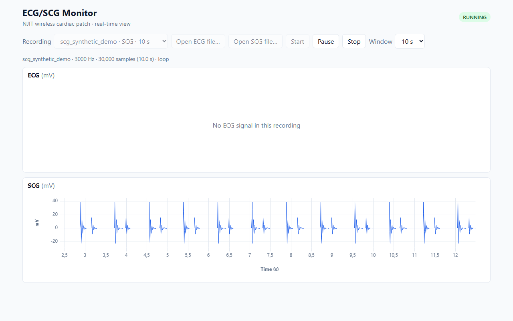

# Weekly update – 2026-10-08

## Done this week

- **The SCG now scrolls live in its own panel** (milestone M2), the same way as the ECG. The lab SCG recording
  (3000 Hz, 9.3 s) replays at its real speed and loops without interruption.
- The app now reads **Excel (.xlsx) and CSV files** directly, as well as the LabVIEW `.lvm` files. The Excel reader
  is downloaded only when an Excel file is opened, so the page still loads quickly.
- Files with a problem (wrong separator, text where a number is expected, an extra column) are rejected with a
  message that names the row. The app never shows wrong data without saying so.
- Two buttons, **Open ECG file…** and **Open SCG file…**, say which signal a file from your computer contains
  (LabVIEW and Excel files do not record it). As before, the file is read in the browser and never uploaded.
- A panel shows a trace only when the recording contains that signal; otherwise it says so. An old ECG trace never
  stays frozen on screen next to a new SCG.
- The public demo now also has a **synthetic SCG** (one vibration burst at aortic opening and a smaller one at
  aortic closing, 72 bpm). The real recordings still stay off GitHub.

## Demo

https://davidedaluisio.github.io/ecg-scg-monitor/ (works in Chrome). In **Recording** choose
`scg_synthetic_demo · SCG`, press **Start**, then try **Pause** and the **Window** menu. The ECG demo is still
there. The lab recordings are only on my computer, where I can show them during the meeting.

## Next week

- M3: ECG and SCG together, stacked on the same time axis, as in Fig. 1F of the paper. Pause freezes both.
- A synthetic ECG + SCG signal with a **known delay** between the R peak and aortic opening. Reading that delay
  on the plot checks that the two panels stay aligned (target: within one sample, 0.33 ms at 3 kHz).
- Playing the two lab recordings side by side, clearly labeled "not simultaneous", because they were recorded at
  different times.

## Questions for the team

- **Sunny (still open):** is there an ECG and SCG recording made **at the same time**? Without one, M3 alignment
  can only be checked on synthetic data.
- **Sunny (still open):** may we publish an anonymized real recording on the demo site, or keep it synthetic only?
- **Arsh:** the Bluetooth questions in `docs/questions-for-team.md` are still open. They do not block M3 or M4.
